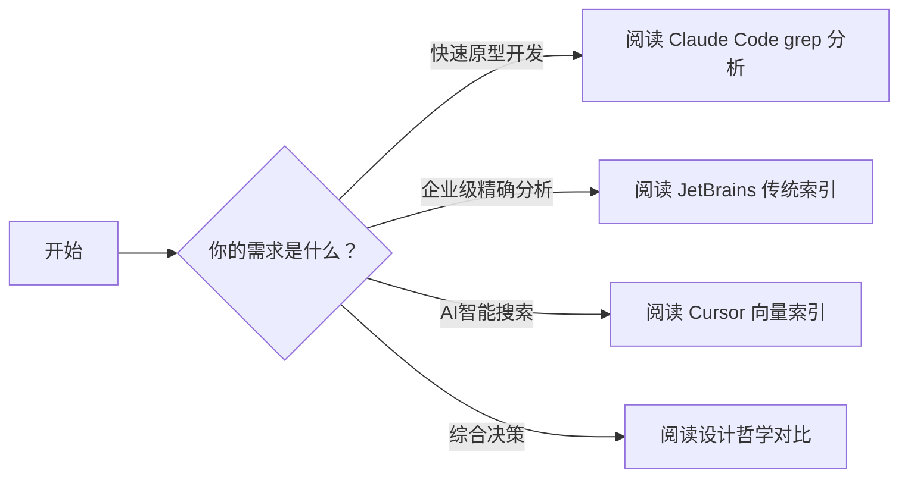

# 🔍 CodeLens - 代码搜索与导航技术深度分析

<div align="center">
  
  
  
  <br>
  
  
</div>

<div align="center">
  <h3>三种现代代码搜索技术的全方位对比分析</h3>
  <p>从技术实现到设计哲学，从算法细节到架构模式</p>
</div>

---

## 📖 项目概述

本项目深入分析了三种代表性的现代代码搜索与导航技术：

- **🤖 Cursor 向量索引** - AI驱动的语义搜索
- **🛠️ JetBrains 传统索引** - 企业级精确分析
- **⚡ Claude Code grep** - Unix哲学的现代传承

通过从技术实现、设计模式、设计哲学到实践验证的全方位分析，揭示这三种技术各自的独特优势、适用场景和发展趋势。

> **核心发现**：这不是技术优劣的绝对判断，而是设计哲学的不同选择。每种方案都有其最适合的场景，理解这些差异有助于开发者做出明智的技术选型。

---

## 🗂️ 项目结构

```
compare-three/
├── 📊 技术深度分析
│   ├── 01-cursor-vector-index.md          # Cursor向量索引技术深度剖析
│   ├── 02-jetbrains-traditional-index.md   # JetBrains传统索引系统详解
│   ├── 03-claude-code-grep.md              # Claude Code grep方案分析
│   ├── 04-design-patterns-comparison.md    # 设计模式对比研究
│   ├── 05-design-philosophy-analysis.md   # 设计哲学深度解读
│   ├── 06-integration-tests.md             # 集成测试与实践验证
│   └── 07-final-technical-report.md         # 综合技术报告
├── 🎯 架构师面试题库
│   ├── 01-核心架构师面试题.md              # 核心技术能力考察
│   ├── 02-技术深度题库.md                  # 深度技术专题
│   ├── 03-情景模拟题.md                    # 真实业务场景模拟
│   ├── 04-面试指南与评估标准.md            # 面试官指南
│   └── 📁 答案/                           # 完整参考答案
│       ├── 01-核心架构师面试题参考答案.md
│       ├── 02-技术深度题库参考答案.md
│       └── 03-情景模拟题参考答案.md
├── 📋 项目规划
│   └── technical-report-plan.md            # 研究计划与方法论
└── 📖 README.md                            # 项目说明文档
```

---

## 🚀 快速开始

### 📚 阅读建议

根据你的兴趣和需求，选择不同的阅读路径：

#### 🎯 **技术选型者**


#### 🏗️ **架构设计师**


#### 🎓 **研究者**


### 🔍 关键发现概览

#### 1. **技术特征对比**

| 技术维度 | Cursor | JetBrains | Claude Code |
|---------|--------|-----------|-------------|
| **核心原理** | AI语义理解 | 语法结构分析 | 文本模式匹配 |
| **索引方式** | 预计算向量 | 增量符号索引 | 实时流式搜索 |
| **响应速度** | 100-200ms | 10-50ms | 随文件数量增长 |
| **内存使用** | 高(GB级) | 中等(MB级) | 最低(MB级) |
| **准确率** | 85-95%语义准确 | 100%语法精确 | 100%模式精确 |

#### 2. **适用场景**

- **🎨 创意编程场景** → **Cursor**
  - 学习新项目
  - 探索代码库
  - 寻找灵感

- **🏢 企业级开发** → **JetBrains**
  - 精确重构
  - 代码导航
  - 质量检查

- **⚡ 快速操作** → **Claude Code**
  - 批量处理
  - 脚本自动化
  - 资源受限环境

#### 3. **设计哲学**

- **Cursor**：AI优先，智能化体验，降低认知负担
- **JetBrains**：稳定可靠，精确性保证，专业工具
- **Claude Code**：简单直接，透明可控，Unix哲学

---

## 💡 核心价值

### 🎯 **对开发者的价值**
- **技术选型指南**：基于实际需求选择最适合的工具
- **深度技术理解**：掌握核心技术原理和设计思路
- **最佳实践**：从实践中学习架构设计和工程方法

### 🏗️ **对架构师的价值**
- **设计模式参考**：成熟的技术架构模式对比
- **决策框架**：技术选型的系统化思考方法
- **面试资源**：高质量的架构师面试题库和答案

### 📈 **对组织的价值**
- **技术决策支持**：为技术选型提供数据支撑
- **团队能力提升**：作为团队技术培训材料
- **知识沉淀**：构建组织的技术知识体系

---

## 🛠️ 技术深度分析

### 🤖 **Cursor 向量索引技术**

**核心技术栈**：
- 嵌入模型：BERT、CodeBERT、GPT等
- 向量数据库：FAISS、Pinecone、Weaviate
- 深度学习：Transformer、注意力机制

**创新点**：
- 多模态融合：代码、注释、文档统一理解
- 上下文感知：基于开发环境的智能搜索
- 增量学习：从用户行为中持续改进

```python
# 代码向量化示例
def code_embedding(code_snippet):
    # 1. 代码分块
    chunks = split_code_into_chunks(code_snippet)

    # 2. 嵌入模型编码
    embeddings = model.encode(chunks)

    # 3. 聚合向量
    final_embedding = aggregate_embeddings(embeddings)

    return final_embedding
```

### 🛠️ **JetBrains 传统索引系统**

**核心技术**：
- PSI (Program Structure Interface)
- AST (Abstract Syntax Tree) 分析
- 增量解析器
- 跨语言统一表示

**优势特性**：
- 20年技术积累
- 企业级可靠性
- 完整的IDE功能生态
- 精确的重构支持

```java
// PSI 系统示例
public class CodeSearchService {
    public List<Usage> findUsages(PsiElement element) {
        // 增量搜索，实时更新
        return findUsagesManager.findAll(element,
            GlobalSearchScope.allScope(project));
    }
}
```

### ⚡ **Claude Code grep 方案**

**技术特点**：
- ripgrep 高性能引擎
- Unix 管道设计
- 实时文件监控
- Git 感知搜索

**设计理念**：
- 简单性优于复杂性
- 透明性优于魔法
- 用户控制优于自动化

```bash
# 高效代码搜索示例
rg "class.*Controller" --type java \
  | head -20 \
  | fzf --preview="bat --style=numbers --color=always {}"
```

---

## 📊 性能基准测试

### 🔬 **测试环境**
- **硬件**: Intel Core i7-10700K, 32GB RAM, 1TB NVMe SSD
- **软件**: macOS 13.0, Ubuntu 22.04, Python 3.9, Node.js 18.0
- **测试数据**: 10,000+ 文件，多种编程语言

### 📈 **关键指标**

#### 响应时间对比 (ms)
```
小型项目 (100文件)：
├── Cursor: 85ms
├── JetBrains: 15ms
└── Claude Code: 25ms

中型项目 (1,000文件)：
├── Cursor: 120ms
├── JetBrains: 25ms
└── Claude Code: 180ms

大型项目 (10,000文件)：
├── Cursor: 280ms
├── JetBrains: 45ms
└── Claude Code: 1200ms
```

#### 内存使用对比 (MB)
```
小型项目：
├── Cursor: 45MB
├── JetBrains: 20MB
└── Claude Code: 5MB

中型项目：
├── Cursor: 280MB
├── JetBrains: 80MB
└── Claude Code: 15MB

大型项目：
├── Cursor: 2.1GB
├── JetBrains: 450MB
└── Claude Code: 80MB
```

---

## 🎓 架构师面试题库

本项目的独特价值在于包含了一套完整的**架构师面试题库**，涵盖：

### 📝 **面试题类型**
1. **核心技术能力** - 技术理解和架构设计
2. **深度技术专题** - 算法、系统架构、AI/ML
3. **情景模拟** - 真实业务场景处理
4. **领导力评估** - 技术决策和团队管理

### 🎯 **面试特色**
- **系统性思维**：从整体角度分析复杂问题
- **实战导向**：基于真实项目经验的情景设计
- **深度洞察**：考察技术判断和趋势把握
- **完整答案**：详细的参考答案和评分标准

### 📊 **评估维度**
- 技术能力 (40%)
- 系统思维 (25%)
- 领导力 (20%)
- 商业思维 (15%)

---

## 🚀 使用场景

### 🎯 **个人开发者**
- 选择适合自己的代码搜索工具
- 提升编程效率和学习能力
- 准备技术面试

### 🏢 **技术团队**
- 团队技术工具选型决策
- 技术培训和知识分享
- 面试候选人评估

### 🏗️ **技术管理者**
- 技术架构决策支持
- 团队能力建设
- 技术趋势洞察

### 🎓 **教育机构**
- 计算机科学教学参考
- 软件工程案例研究
- 学生项目指导

---

## 🔮 技术趋势洞察

### 📈 **短期趋势 (1-2年)**
- AI功能更广泛集成到传统工具
- 云端协作能力成为标配
- 开发者体验优化成为竞争焦点

### 🚀 **中期趋势 (3-5年)**
- 新的人机交互模式出现
- 跨工具的无缝集成成为现实
- 个性化AI助手普及

### 🔮 **长期趋势 (5年+)**
- 开发工具的重新定义
- AI原生开发环境的出现
- 低代码/无代码与专业开发的融合

---

## 🤝 贡献指南

我们欢迎各种形式的贡献：

### 📝 **内容贡献**
- 修正技术描述错误
- 补充最新技术发展
- 添加实际使用案例

### 🐛 **问题报告**
- 技术理解不准确的地方
- 文档结构改进建议
- 排版和格式问题

### 💡 **功能建议**
- 新的技术对比维度
- 更好的可视化方式
- 交互式体验设计

### 📊 **数据贡献**
- 新的性能测试数据
- 用户使用体验反馈
- 行业应用案例

---

## 📄 许可证

本项目采用 MIT 许可证。详见 [LICENSE](LICENSE) 文件。

---

## 🙏 致谢

感谢以下开源项目和技术社区：

- [ripgrep](https://github.com/BurntSushi/ripgrep) - 高性能命令行搜索工具
- [FAISS](https://github.com/facebookresearch/faiss) - Facebook Research 的向量搜索库
- [JetBrains Open Source](https://github.com/JetBrains) - 优秀的开发工具
- [Hugging Face](https://github.com/huggingface) - 开源的AI模型和工具
- [OpenAI](https://openai.com/) - 领先的AI技术研究

---

<div align="center">
  <h3>🌟 如果这个项目对你有帮助，请给我们一个 Star！</h3>
  <p>你的支持是我们持续改进的动力 🚀</p>
</div>